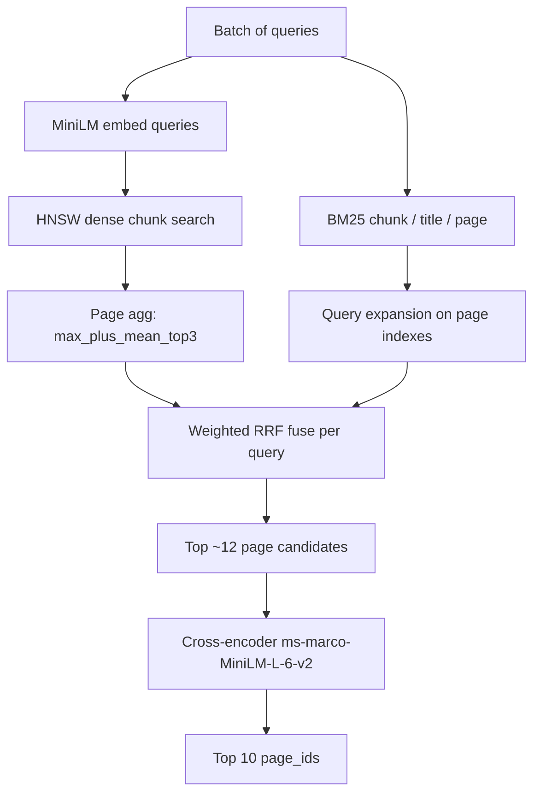

# Section B — Multi-index hybrid retrieval + cross-encoder rerank

Wikipedia **page retrieval** for Section B. The autograder calls `main.run(queries)` once per batch; this repo ships **prebuilt `artifacts/`** (Git LFS) so staff do not rebuild at grading time.

**Current public benchmark** (50 queries, submission `artifacts/`):

| Metric | Value |
|--------|-------|
| `mean_ndcg@10` | **0.3011** |
| `query_phase_time` | **~30s** (limit 60s) |

---

## Quick start (matches grading)

Dependencies are assumed **already installed** (`numpy`, `sentence-transformers`, `faiss-cpu`, `torch`). No `pip install` during grading.

```bash
git clone https://github.com/tavor7/LAB-SectionB.git
cd LAB-SectionB
git lfs pull                              # required: large artifacts
python scripts/check_submission.py        # artifacts + run() smoke test
python scripts/eval_public.py             # mean NDCG@10 + query time
```

---

## Solution overview (how we got here)

| Stage | What changed | Public NDCG@10 (approx.) |
|-------|----------------|--------------------------|
| 1. Baseline hybrid | Dense (MiniLM) + single BM25 chunk, RRF | ~0.236 |
| 2. Multi-index | + BM25 title & page indexes, tuned RRF weights | ~0.252–0.255 |
| 3. Chunk experiments | Tested 400/320/240 vs 140-word chunks (local sweep) | 140 won on fold metrics |
| 4. **Partner merge** | Cross-encoder rerank on RRF candidate pool (`mgalamidi/partb`) | **~0.301** |

**Submission ships stage 4 code + stage 2 index** (`artifacts/` at 140/35 chunks). Chunk-size sweep artifacts stay local under `artifacts_sweep/` (gitignored).

### Partner contribution (Maayan Galamidi)

Merged from branch `mgalamidi/partb`:

- **`retrieve.py`**: batched **cross-encoder reranking** (`cross-encoder/ms-marco-MiniLM-L-6-v2`) over a small RRF candidate pool (~12 pages/query).
- **Global batching** across all queries in one `predict()` call for CPU efficiency.
- Document text for reranking: `Title: {title}. Context: {first 120 words of page}`.
- **`hparams.json`**: retrieve fusion weights tuned for the cross-encoder pipeline.

Recall still comes from the **multi-index RRF** stack built by Amit; the cross-encoder **reorders** the top candidates.

---

## Query-time pipeline (grading path)



**Per query:**

1. **Dense (HNSW)** — `all-MiniLM-L6-v2`, chunk hits → page scores via `max_plus_mean_top3`.
2. **BM25 chunk** — original query on 140/35 word chunks.
3. **BM25 title** — page-level title index (query expansion: original + keyword).
4. **BM25 page** — full-page index (same expansion).
5. **Weighted RRF** — fuse the four rankings (`rrf_k=15`; weights in `hparams.json`).
6. **Cross-encoder rerank** — score each `(query, title+snippet)` pair; return top 10 `page_id`s.

If extended artifacts (`page_features.npz`, prefixed BM25) are missing, `retrieve.py` falls back to legacy dense + single BM25 RRF (no cross-encoder path).

---

## Offline build pipeline (not timed at grading)

Corpus: unzip handout to `data/Wikipedia Entries/` (~27k JSON pages). **Not in git.**

### 1. Configure chunking

Edit `hparams.json` → `chunking` (submission index: **140 words / 35 overlap**, title chunk enabled).

### 2. Full index build

```bash
pip install -r requirements.txt    # developers only
python scripts/build_index.py
```

**Produces `artifacts/`:**

| Output | Purpose |
|--------|---------|
| `faiss.index` | HNSW on L2-normalized MiniLM chunk vectors |
| `page_ids.npy` | Row → `page_id` |
| `index_vectors.npy` | Dense vectors (optional brute mode) |
| `bm25_chunk_*` | BM25 over chunks (+ legacy `bm25_*` alias) |
| `bm25_title_*` | BM25 one doc per page (title) |
| `bm25_page_*` | BM25 one doc per page (full text) |
| `page_features.npz` | Titles + content for rerank / CE snippets |
| `meta.json` | Model, dims, chunking metadata |

**Checkpointing:** shards under `artifacts/shards/` + `build_checkpoint.json` (gitignored). Re-run the same command to resume; changing `chunk_words` / overlap invalidates the checkpoint.

**Dev mini-build** (fast iteration):

```bash
BUILD_DEV_PUBLIC=1 BUILD_DEV_NUM_QUERIES=10 BUILD_DEV_NEG_PAGES=3000 python -u scripts/build_index.py
DEV_EVAL_NUM_QUERIES=10 python -u eval_dev.py
```

### 3. Optional: chunk-size sweep (local R&D only)

Experimental indexes live in **`artifacts_sweep/w{chunk}_o{overlap}/`** (gitignored). Does **not** ship with submission unless copied into `artifacts/`.

```bash
python scripts/sweep_chunk_sizes.py list
python scripts/sweep_chunk_sizes.py build --chunk-words 400   # one variant
python scripts/sweep_chunk_sizes.py eval --folds 5              # median-fold comparison
python scripts/eval_public.py --artifacts-dir artifacts_sweep/w400_o100
```

We tested **400, 320, 240** vs **140**; **140/35** remained best on median-fold NDCG for the legacy index. Sweep tooling: `artifact_registry.py`, `scripts/sweep_chunk_sizes.py`, `scripts/tune_retrieve.py`.

---

## Pre-submission checklist

Run from repo root (`PartB/`):

```bash
# 1. LFS artifacts present
git lfs pull

# 2. Required files + run() works
python scripts/check_submission.py

# 3. Public eval (grading-style)
python scripts/eval_public.py
# Expect: mean_ndcg@10 ≈ 0.30, query_phase_time < 60s

# 4. Git hygiene
git status          # no accidental artifacts_sweep/ or *.log staged
git log --oneline   # commits from both partners (see AUTHORS.md)
```

| Check | Pass criteria |
|-------|----------------|
| `artifacts/faiss.index` | Present (LFS) |
| `artifacts/page_features.npz` + multi-BM25 | Present for full pipeline |
| `hparams.json` chunking | Matches `artifacts/meta.json` (140/35) |
| `query_phase_time` | < 60s for 50 queries |
| `data/public_queries.json` | In repo |
| Partner authorship | Both in `AUTHORS.md` + git history |

---

## Repository layout

| Path | Role |
|------|------|
| `main.py` | `run(queries)` → ranked `page_id` lists |
| `retrieve.py` | Multi-index RRF + cross-encoder rerank |
| `query_expand.py` | Stopword-stripped keyword queries |
| `embed.py` | `all-MiniLM-L6-v2` embeddings |
| `index.py` | Offline FAISS + BM25 writers |
| `lexical.py` | BM25 build/load/search |
| `chunk.py` | Word-window chunking |
| `artifact_registry.py` | Sweep manifest helpers (local dev) |
| `config.py` / `hparams.json` | Hyperparameters |
| `scripts/check_submission.py` | Grading readiness smoke test |
| `scripts/eval_public.py` | 50 public queries, NDCG@10 |
| `scripts/build_index.py` | Offline full build |
| `scripts/sweep_chunk_sizes.py` | Chunk sweep build/eval/ship |
| `scripts/tune_retrieve.py` | Retrieve hparam grid search (local) |
| `artifacts/` | **Submission index** (Git LFS) |
| `artifacts_sweep/` | Local experiments (**gitignored**) |

---

## Key hyperparameters (`hparams.json`)

**Chunking (submission index):** `chunk_words=140`, `overlap_words=35`, `title_chunk=true`

**Retrieval:**

| Key | Submission value | Notes |
|-----|------------------|-------|
| `candidate_multiplier` | 400 | Dense/BM25 pool depth |
| `page_aggregation` | `max_plus_mean_top3` | Chunk → page |
| `rrf_k` | 15 | RRF fusion |
| `dense_rrf_weight` | 1.0 | |
| `bm25_chunk_rrf_weight` | 1.03 | |
| `title_bm25_rrf_weight` | 0.35 | |
| `page_bm25_rrf_weight` | 0.86 | |
| `use_query_expansion` | true | Page/title BM25 |

Cross-encoder pool size is fixed in `retrieve.py` (`rerank_cap ≈ 12`).

---

## Collaboration

See **[AUTHORS.md](AUTHORS.md)**. Both partners must have meaningful commits in `git log`.

## Submit

Public GitHub repo: this code, `data/public_queries.json`, LFS-backed `artifacts/`, and this README. See the assignment PDF for the video and full rubric.
