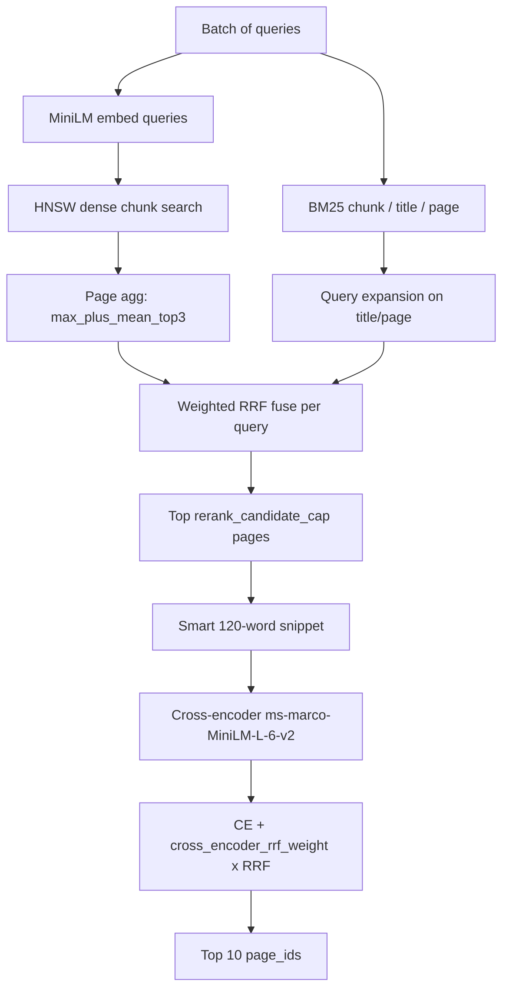

# Section B — Multi-index hybrid retrieval + cross-encoder rerank

Wikipedia **page retrieval** for Section B. The autograder calls `main.run(queries)` once per batch; this repo ships **prebuilt `artifacts/`** (Git LFS) so staff do not rebuild at grading time.

**Current public benchmark** (`artifacts/`, paragraph index):

| Metric | Value |
|--------|-------|
| `mean_ndcg@10` | **0.4752** (29 public queries in `data/public_queries.json`) |
| `query_phase_time` | **~20s** (limit 60s) |
| Index vectors | **~212k** paragraph chunks |

### What lives where

```
LAB-SectionB/
├── main.py, retrieve.py, …     # grading entry points
├── hparams.json, config.py     # hyperparameters
├── artifacts/                  # submission index (Git LFS)
├── data/public_queries.json    # public eval queries
├── scripts/
│   ├── check_submission.py
│   ├── eval_public.py
│   ├── build_index.py
│   ├── run_build_detached.sh   # crash-safe detached build
│   └── dev/                    # local R&D (optional)
├── logs/                       # build logs (gitignored)
├── local/                      # handout copies (gitignored)
└── artifacts_backup*/          # old index backups (gitignored)
```

---

## Quick start (matches grading)

Dependencies are assumed **already installed** (`numpy`, `sentence-transformers`, `faiss-cpu`, `torch`). No `pip install` during grading.

```bash
git clone https://github.com/tavor7/LAB-SectionB.git
cd LAB-SectionB
git lfs pull                              # required: large artifacts
python scripts/check_submission.py        # artifacts + run() smoke test
python scripts/eval_public.py             # mean NDCG@10 + query time
```

---

## Solution overview

| Stage | What changed | Notes |
|-------|----------------|-------|
| 1. Baseline hybrid | Dense (MiniLM) + BM25 chunk, RRF | ~0.24 NDCG |
| 2. Multi-index | + BM25 title & page, tuned RRF | Stronger recall |
| 3. Cross-encoder | Batched CE rerank on RRF pool | Major NDCG gain |
| 4. Smart snippets | Query-aligned 120-word CE context | Better rerank input |
| 5. **Paragraph index** | Paragraph packing + word overlap (400/100) | **Current `artifacts/`** |

### Partner contribution (Maayan Galamidi)

- Cross-encoder reranking (`cross-encoder/ms-marco-MiniLM-L-6-v2`)
- Smart snippet windowing for CE input
- Retrieve hyperparameter tuning (`hparams.json`)

### Index build (Amit Tavor)

- **Paragraph chunking** — merge `\n\n` paragraphs up to `max_chunk_words`, then word-level overlap
- Checkpointed offline build with crash resume
- Previous 140/35 word-window index: `artifacts_backup_word140_o35/` (local, gitignored)

---

## Query-time pipeline



**Per query:**

1. **Dense (HNSW)** — `all-MiniLM-L6-v2` on paragraph chunks; page aggregation `max_plus_mean_top3` (0.2 max + 0.8 mean top-3).
2. **BM25 chunk** — original query on paragraph chunks (`Title:/Content:` format).
3. **BM25 title** — page-level title index (query expansion).
4. **BM25 page** — full-page index (query expansion).
5. **Weighted RRF** — fuse four rankings (`rrf_k=20`; weights in `hparams.json`).
6. **Smart snippet** — 120-word window with most query-token overlap (step 20).
7. **Cross-encoder rerank** — `CE_score + cross_encoder_rrf_weight × rrf_score`; return top 10.

---

## Repository layout

| Path | Role |
|------|------|
| `main.py` | `run(queries)` → ranked `page_id` lists |
| `retrieve.py` | Multi-index RRF + cross-encoder rerank |
| `chunk.py` | Paragraph or word-window chunking |
| `index.py` | Offline FAISS + BM25 writers (checkpointed) |
| `hparams.json` | Chunking, FAISS, BM25, retrieve, build params |
| `scripts/check_submission.py` | Grading readiness smoke test |
| `scripts/eval_public.py` | Public queries, NDCG@10 |
| `scripts/build_index.py` | Offline full index build |
| `scripts/run_build_detached.sh` | Detached build (survives IDE disconnect) |
| `scripts/dev/` | Local sweep/tuning tools (optional) |
| `artifacts/` | **Submission index** (Git LFS) |
| `data/public_queries.json` | Public eval queries |

Corpus `data/Wikipedia Entries/` is **not** in git (handout only; needed to rebuild).

---

## Key hyperparameters (`hparams.json`)

**Chunking (current index):**

```json
"chunking": {
  "mode": "paragraph",
  "max_chunk_words": 400,
  "overlap_words": 100,
  "title_chunk": true
}
```

Must match `artifacts/meta.json` → `chunking.strategy`.

**Build-time (baked into index):**

| Group | Keys | Role |
|-------|------|------|
| `faiss_hnsw` | `M`, `ef_construction` | HNSW graph quality at build |
| `bm25` | `k1`, `b` | BM25 scoring in all lexical indexes |

**Query-time:**

| Key | Value | Notes |
|-----|-------|-------|
| `candidate_multiplier` | 400 | Dense/BM25 pool depth |
| `rerank_candidate_cap` | 20 | CE pool size per query |
| `cross_encoder_rrf_weight` | 3.0 | RRF blend into final CE score |
| `faiss_hnsw.ef_search_floor` | 512 | HNSW search depth floor |

---

## Offline build (not timed at grading)

```bash
pip install -r requirements.txt    # developers only
# unzip corpus to data/Wikipedia Entries/
python scripts/build_index.py
```

**Crash-safe / long runs:**

- Checkpoints every 200 pages → `artifacts/shards/` + `build_checkpoint.json`
- Re-run the same command to resume (invalidates if chunking changes)
- Detached build (survives closing IDE):

```bash
scripts/run_build_detached.sh
tail -f logs/build_paragraph.log
```

**Backup before rebuild:**

```bash
mv artifacts artifacts_backup_word140_o35
mkdir artifacts
python scripts/build_index.py
```

---

## Pre-submission checklist

```bash
git lfs pull
python scripts/check_submission.py
python scripts/eval_public.py    # query_phase_time < 60s
python -c "
import json
h=json.load(open('hparams.json'))['chunking']
m=json.load(open('artifacts/meta.json'))['chunking']
assert m['strategy']==h.get('mode', m['strategy'])
assert m['max_chunk_words']==h['max_chunk_words']
print('chunking OK')
"
```

---

## Collaboration

See **[AUTHORS.md](AUTHORS.md)**. Both partners must have meaningful commits in `git log`.

## Submit

Public GitHub repo: this code, `data/public_queries.json`, LFS-backed `artifacts/`, and this README.
